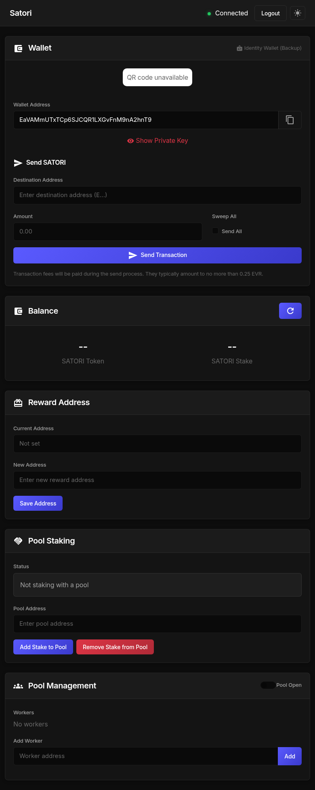

# Satori Network User Guide

Quick reference for Independent Predictors, Pool Operators, and Pool Stakers.

> **Note:** This guide includes placeholders for screenshots of recently added features (pool stakers list, audit downloads, automated payments). See `capture-screenshots.md` for instructions on capturing these screenshots when the application is running.

---

## Independent Predictors

**What you do:** Make predictions on data streams to earn SATORI tokens.

**How it works:**
1. **Run a node** - Install and run the Satori prediction software
2. **Make predictions** - Your node automatically predicts future values for assigned data streams
3. **Earn rewards** - Accurate predictions earn you SATORI tokens based on prediction quality
4. **Maintain stake** - Keep at least 50 SATORI tokens to qualify for rewards

**Key requirements:**
- Minimum 50 SATORI balance to qualify
- Better prediction accuracy = higher rewards
- Predictions ranked by distance from actual value

**Optional: Join a pool**
- Get balance boosts from a pool to meet the 50 token minimum
- **IMPORTANT:** You must set your `reward_address` to match the pool's address
- Without matching reward_address, you won't receive boosts
- Pool helps you qualify in exchange for rewards

> **Note:** Set your reward address in the Dashboard → Reward Address section. Enter the pool's address in "New Address" field and click "Save Address".

---

## Pool Operators

**What you do:** Boost workers' balances to help them qualify, receive their rewards, and pay commission to pool stakers.

### Basic Operations

**Setting up a pool:**
1. Set commission percentage (0-100%) in Dashboard → Pool Settings
2. Workers join your pool by adding your address
3. Pool stakers stake tokens to increase your pool's balance

**How pool boosts work:**
- Your pool balance (own tokens + pool staker contributions) is distributed to workers
- Workers are boosted to 50 token minimum in order of prediction quality
- **Workers must set their reward_address to match your pool to receive boosts**
- After distributing, your pool receives all workers' rewards

### Audit Files

**Location:** Dashboard → Pool section → "Pool Audits" buttons

> **📸 SCREENSHOT NEEDED:** Dashboard showing the Pool section with two download buttons:
> - "Download Workers Audit" button
> - "Download Pool Stakers Audit" button
> - Small help text below: "Download the latest audit files showing worker distributions and pool staker commissions."

**Two audit files available:**
- **workers.json** - Shows how your pool balance was distributed to workers
- **lenders.json** - Shows what you owe each pool staker (commission on earnings)

### Understanding lenders.json

This is what you need to pay your pool stakers.

**Example lenders.json:**
```json
{
  "observation_id": 123,
  "observation_value": "42000.50",
  "observation_ts": "2025-12-04T12:00:00Z",
  "pools": [
    {
      "pool_id": 42,
      "pool_address": "EPoolAddress123",
      "pool_commission": 30,
      "pool_earnings": 155.0,
      "total_lender_contributions": 150.0,
      "total_owed_to_lenders": 46.5,
      "lenders": [
        {
          "lender_id": 10,
          "lender_address": "ELenderA...",
          "contribution": 50.0,
          "contribution_percentage": 33.33,
          "owed_amount": 15.5
        },
        {
          "lender_id": 11,
          "lender_address": "ELenderB...",
          "contribution": 100.0,
          "contribution_percentage": 66.67,
          "owed_amount": 31.0
        }
      ]
    }
  ]
}
```

**What you care about:**
- **`owed_amount`** for each pool staker - This is what you owe them
- **`total_owed_to_lenders`** - Total you owe all pool stakers (should equal sum of individual amounts)

**Calculation:**
```
pool_earnings = Your balance after distributing to workers
total_owed = pool_earnings × (commission% / 100)
each_staker_owed = (their_contribution / total_contributions) × total_owed
```

**Example:**
- You earned 155 tokens after distributing to workers
- Commission is 30%
- Total owed to pool stakers = 155 × 0.30 = 46.5 tokens
- Pool Staker A contributed 33.33% → gets 15.5 tokens
- Pool Staker B contributed 66.67% → gets 31.0 tokens

### Paying Pool Stakers

**Manual option:**
1. Download lenders.json audit file
2. Read the `owed_amount` for each pool staker
3. Send SATORI tokens manually to each pool staker address

**Automatic option:**
1. Click "Pay Lenders From Audit" button in Dashboard → Pool section
2. System reads latest lenders.json automatically
3. Confirms payment details (shows total amount and number of pool stakers)
4. Sends one transaction to all pool stakers (up to 1000 pool stakers supported)

> **📸 SCREENSHOT NEEDED:** Dashboard Pool section showing:
> - Green "Pay Pool Stakers From Audit" button
> - Help text: "Automatically pay your pool stakers based on the latest audit file"
>
> **📸 SCREENSHOT NEEDED:** Payment confirmation dialog showing:
> - "Pay 2 pool stakers a total of 46.5 SATORI?"
> - List of pool stakers with amounts
> - OK/Cancel buttons

**Requirements for automatic payment:**
- Vault must be unlocked
- Sufficient SATORI balance to cover total owed amount
- Maximum 1000 pool stakers per transaction

---

## Pool Stakers

**What you do:** Stake tokens to a pool, receive commission on pool earnings.

**How it works:**
1. **Choose a pool** - Find a pool with good commission rate (higher % = more earnings for you)
2. **Stake tokens** - Your tokens are added to the pool's balance for distributing to workers
3. **Pool uses your tokens** - Pool distributes your tokens (plus their own) to boost workers
4. **Pool earns rewards** - Pool receives rewards from all boosted workers
5. **Receive commission** - Pool operator pays you a percentage of their earnings

**Example:**
- You stake 100 SATORI to a pool with 30% commission
- Pool also has 70 SATORI of their own (total: 170)
- Pool distributes 15 SATORI to workers
- Pool earnings after distribution: 155 SATORI
- Total owed to all pool stakers: 155 × 30% = 46.5 SATORI
- Your contribution: 100 / 150 = 66.67%
- Your commission: 66.67% × 46.5 = 31.0 SATORI

**Checking what you're owed:**
1. Ask pool operator for lenders.json audit file
2. Find your address in the lenders array (technical term in the file)
3. Check your `owed_amount`

**Key points:**
- Higher commission% = more earnings for you
- Your share is proportional to your contribution
- Pool operator is responsible for paying you
- Audit files provide transparent calculation

**Risk:** Pool operator may not pay commission. Choose reputable pools.

---

## Dashboard Overview


*Dashboard showing Wallet, Balance, Reward Address, Pool Staking, and Pool Management sections*

**Main sections:**

1. **Wallet**
   - View balance, address, QR code
   - Send SATORI tokens
   - Manage vault (password-protected wallet for storing funds)

2. **Prediction Settings**
   - Set reward address (important for pool workers!)
   - Configure prediction parameters

3. **Pool Management** (for pool operators only)
   - Set commission percentage
   - View workers and pool stakers lists
   - Download audit files (workers.json, lenders.json)
   - Pay pool stakers automatically

4. **Pool Staking** (for pool stakers only)
   - Select pool to stake to
   - View current staking relationship

---

## Key Concepts

**Addresses:**
- **Wallet Address** - Your main receiving address (starts with E)
- **Vault Address** - Separate address for storing funds (optional)
- **Reward Address** - Where your prediction rewards are sent

**Balance Types:**
- **Wallet Balance** - Actual SATORI tokens you own
- **Stake Balance** - Virtual balance used for scoring (includes pool boosts)
- Pool boosts are temporary - they help you qualify, but rewards go to pool

**Worker Reward Address Requirement:**
- Workers MUST set reward_address to match their pool's address
- Matching priority: pool's reward_address → vault_address → wallet_address
- Without match: no boost from pool
- This ensures fair exchange: boost for rewards

**Commission:**
- Pool operator sets commission percentage (0-100%)
- Higher % = more for pool stakers, less for pool operator
- Commission is paid on pool earnings after distributing to workers
- Typical range: 10-40%

---

## Common Questions

**Q: Why didn't I receive pool boosts?**
A: Check that your reward_address matches your pool's address exactly. This is required as of the latest update.

**Q: How often are audits generated?**
A: Once per day after scoring runs (typically daily).

**Q: Can I stake to multiple pools?**
A: No, you can only stake to one pool at a time.

**Q: What if pool operator doesn't pay commission?**
A: Commission payment is off-chain and relies on pool operator honesty. Choose reputable pools. Audit files provide transparent proof of what's owed.

**Q: How many pool stakers can receive payment in one transaction?**
A: Up to 1000 pool stakers per transaction using the automated payment system.

**Q: What happens if I don't have 50 SATORI?**
A: You won't qualify for rewards. Join a pool to get boosted, or acquire more tokens.

---

## API Endpoints

**For developers and advanced users:**

**Public audit endpoints:**
```
GET https://central.satorinet.io/api/v1/audit/workers/latest
GET https://central.satorinet.io/api/v1/audit/stakers/latest
```

**Authenticated endpoints:** (require wallet signature)
```
GET /api/v1/pool/workers - List your pool's workers
GET /api/v1/pool/lenders - List your pool's pool stakers
POST /api/v1/peer/reward-address - Set your reward address
POST /api/lender/pay - Pay pool stakers from audit (frontend only)
```

---

## Support

For issues, questions, or feature requests:
- GitHub: https://github.com/SatoriNetwork
- Documentation: https://satorinet.io/docs

---

**Version:** 1.0
**Last Updated:** December 17, 2024
